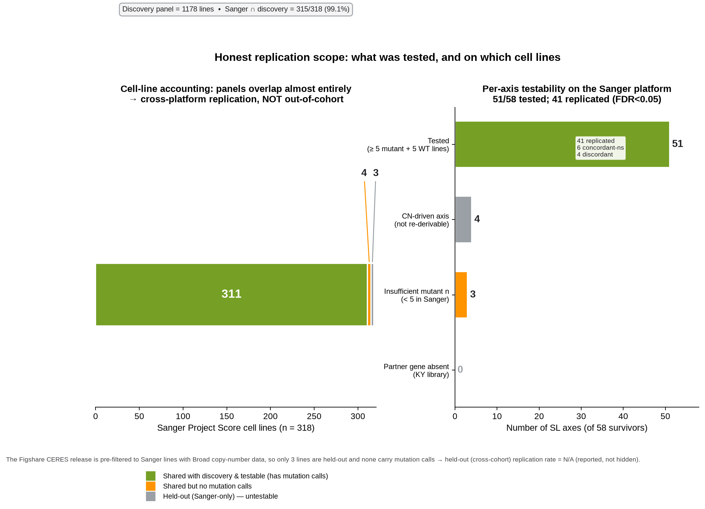

## Introduction

Synthetic lethality (SL) — a genetic interaction in which the co-occurrence of two perturbations is
lethal while either alone is tolerated — is one of the few mechanistic levers that converts a tumor's
loss-of-function genotype into a selective therapeutic vulnerability [@ohara2021; @huang2020]. The
clinical validity of the paradigm is established by PARP inhibition in *BRCA1/2*-mutant cancers
[@lord2017; @farmer2005; @bryant2005], and genome-scale CRISPR-Cas9 loss-of-function screens across
large cancer cell-line panels (DepMap; Project Score) now make it possible to nominate genotype-selective
dependencies systematically [@tsherniak2017; @behan2019; @meyers2017].

The difficulty is not generating nominations — it is trusting them. Differential-dependency signals are
routinely confounded by co-occurring features such as microsatellite instability (MSI), *TP53* status,
copy-number, and lineage composition; effect sizes drift between screening pipelines; and a statistically
significant dependency is not, by itself, a druggable or clinically interpretable hypothesis. Reviews of
functional-genomics SL screens repeatedly stress reproducibility, confounding, and context-specificity
as the dominant failure modes [@ohara2021; @ryan2018]. A nomination pipeline that does not separate
"a signal survived a t-test" from "an orthogonally replicated, confound-controlled, evidence-graded,
actionable hypothesis" will over-promise.

Here we make that separation explicit. We define a **five-layer validation framework** and apply it end
to end: first to a single, fully worked anchor case — MBD4 loss-of-function — where we can show each layer
against concrete receipts; then to a pan-cancer portfolio of 58 driver->partner SL axes, where the same
layers are applied at scale. Throughout, we foreground the honest ceiling of what dependency data can and
cannot prove, and we tag every quantitative claim to a machine-readable receipt.

This manuscript is deliberately scoped to the **synthetic-lethality** program. The MBD4 anchor has a
non-SL immunotherapy dimension (a hypermutator/immune-checkpoint hypothesis) that is treated elsewhere;
it is out of scope here. We use MBD4 strictly as the SL worked example, including the *falsified* PARP1
mechanism, because a validation framework is only credible if it also reports what it rules out.

## The five-layer validation framework

We define the framework verbatim so the term is unambiguous. Each layer answers a distinct question and
has an explicit pass/fail or grading criterion; a nomination advances only as far as the evidence
supports.

- **Layer 1 — Known-SL truth-set recovery (calibration).** Can the pipeline recover curated,
  independently established SL interactions from the same dependency data? This calibrates sensitivity
  and exposes modality blind spots (e.g., drug-trapping mechanisms that gene knockout cannot model).

- **Layer 2 — Discovery by differential dependency.** Genome-wide, genotype-stratified comparison of
  dependency (Chronos/CERES gene-effect) between driver-altered and wild-type lines, ranked by effect
  size and significance, to nominate candidate driver->partner axes.

- **Layer 3 — Confound stress-testing.** Each promoted axis is challenged against the confounders that
  dominate SL false positives: MSI status, *TP53* co-mutation, lineage composition, and single-line
  leverage (leave-one-out). A signal that inverts, evaporates, or is carried by one line or one lineage
  does not advance.

- **Layer 4 — Cross-screen integration-robustness and cross-platform independent replication.** Two
  distinct checks: (a) *integration-robustness* — does the signal survive the screen-integration pipeline
  (per-screen effect vs integrated model on the same platform)? and (b) *cross-platform replication* —
  does it reproduce in an orthogonal library + wet-lab + analysis pipeline (Sanger Project Score CERES vs
  Broad Avana+Chronos)? We report these separately and never conflate them.

- **Layer 5 — Clinical evidence ladder, trust tiers, and actionability.** Each axis is graded on a
  clinical-evidence ladder (E1 approved drug in matched context -> E5 computational-only nomination),
  assigned a two-dimensional trust tier that crosses clinical anchoring with replication status, and
  annotated for druggability/actionability against curated drug and pharmacogenomic resources.

Layers 1-3 correspond to the confound-validated discovery layer established previously for the anchor
case; Layers 4-5 are the external-validation and trust-scoring layer added for the pan-cancer portfolio.
The framework is a contract: it fixes, in advance, what has to be true for a nomination to be reported
at each level of confidence.

## Anchor case: MBD4 loss-of-function

MBD4 (methyl-CpG-binding domain protein 4) is a BER glycosylase that excises thymine from G:T mismatches
generated by spontaneous deamination of 5-methylcytosine at CpG sites; its loss produces a CpG>TpG
hypermutator phenotype and BER deficiency [@hendrich1999; @bader1999; @krokan2013; @wallace2012]. We use
MBD4-LOF as the anchor because it exercises every layer of the framework with concrete receipts, and
because it includes a genuine falsification.

**Cohort (receipts).** In DepMap 24Q2, loss-of-function status was called exclusively from the
LikelyLoF annotation (missense/passenger variants purged at the classification gate), yielding
n=21 MBD4-LOF lines, of which 15 are *TP53* co-mutated and 6 are MSI-H. Drug-screen intersections with
GDSC2 reduce per-drug denominators (ceralasertib n=14; adavosertib n=15).

**Layer 1 (calibration) — cytidine-analog SL is the gold standard.** The MBD4-cytidine-analog interaction
is an isogenic, rescue-confirmed SL: MBD4-knockout cells are hypersensitive to gemcitabine and cytarabine,
with sensitivity reverting on MBD4 re-expression [@chabot2022]. This is the strongest evidence class and
sets the calibration bar against which downstream findings are judged.

**Layer 2-3 (discovery + confounds) — a replication-stress ATR dependency.** Genotype-stratified GDSC2
analysis shows MBD4-LOF lines are significantly more sensitive to the ATR inhibitor ceralasertib (AZD6738)
than wild-type: LN_IC50 Delta=-0.73 (one-sided p=0.022, Cohen's d=-0.50; n=14 LOF vs 922 WT; two-sided
p=0.044), directionally concordant across all three GDSC2 potency metrics (AUC Delta=-0.06, one-sided
p=0.013, d=-0.55; Z-score Delta=-0.50, one-sided p=0.022, d=-0.50). The WEE1 inhibitor adavosertib shows
the same direction sub-significantly (LN_IC50 Delta=-0.51, one-sided p=0.074). The ceralasertib signal survives four orthogonal confound stress tests:
it *strengthens* after removing MSI-H lines (Delta=-0.91, one-sided p=0.015), remains large after
isolating the MBD4 contribution within a *TP53*-mutant background (Delta=-1.07, one-sided p=0.003,
d=-0.74), retains one-sided p<0.05 in 14/14 leave-one-out iterations, and is preserved outside the
dominant lineage (non-bowel Delta=-0.87, one-sided p=0.025). All anchor drug-response tests are one-sided
(directional SL hypothesis: LOF more sensitive). This is the Layer-3 pattern a real driver->partner axis should produce.

**A falsification, retained as a cautionary vignette.** It has been proposed that BER deficiency drives
compensatory PARP1 upregulation, creating a PARP-trapping vulnerability. In DepMap 24Q2 expression,
MBD4-LOF lines show **no** PARP1 elevation (n=19 LOF with expression, out of 21 MBD4-LikelyLoF models;
median 6.77 vs 6.64 in non-LOF lines): the hypothesized *upregulation* direction is not supported
(one-sided Mann-Whitney p=0.27; two-sided p=0.53), and the proposed RNF144A degradation bridge is
likewise absent (one-sided p=0.28; two-sided p=0.56). The specific transcriptional-upregulation mechanism
is therefore falsified for MBD4. Separately, PARP1 expression is a strong pan-cancer predictor of
PARP-inhibitor sensitivity (Spearman rho=-0.42, p=5.2x10^-22, n=488; GDSC2), so the marker is real but is
*not* switched on by MBD4 status. We keep this vignette in the SL
manuscript precisely because it demonstrates Layer-3 discipline: an attractive, mechanistically plausible
SL hypothesis that the data do not support is reported as falsified, not quietly dropped. PARP inhibition
is not advanced as an MBD4 SL axis on this basis.

The anchor therefore yields two supported SL levers (cytidine analogs, gold standard; ATR inhibition,
confound-validated) converging on the replication fork, and one explicitly ruled-out mechanism. It is the
template for how a single axis should look after Layers 1-3.

## Generalization: a pan-cancer 58-axis SL portfolio

We applied the same framework at scale to 58 driver->partner SL axes surviving discovery and confound
stress-testing. Discovery used the DepMap 24Q4 integrated Chronos matrix (CRISPRGeneEffect, 1178 lines x
17,916 genes); mutation calls from DepMap 24Q4 OmicsSomaticMutations; and drug/pharmacogenomic annotation
from the Broad Drug Repurposing Hub and ClinPGx.

### Layer 1 at scale: known-SL recovery and modality limits

Against a curated truth set of 27 known SL pairs (4 approved, 13 pivotal-trial, 10 preclinical-validated),
the CRISPR-visible recall was 10/22 = 0.455, with recovery concentrated in the higher-evidence tiers
(approved 1/2; pivotal-trial 6/11; preclinical 3/9). PARP-modality pairs were recovered at only 1/5 and
are excluded from primary recall *by design*, because gene knockout cannot model PARP trapping — the same
modality blind spot the MBD4 vignette illustrates. All misses are mechanistically explained (modality,
partner absent from the library, or copy-number axis). Precision is not meaningfully computable against a
truth set dominated by novel positives; we therefore report recall and reclassification-correctness only.

### Layer 4 at scale: integration-robustness vs cross-platform replication

We report two distinct L4 checks and keep them strictly separate.

**(a) Within-platform integration-robustness.** Comparing per-screen gene effect (DepMap 24Q4
ScreenGeneEffect, 1186 models) to the integrated Chronos model, 53/53 mutation-testable survivors preserve
sign and significance, with effect-size Spearman rho=0.973 (p=4.8x10^-34), Pearson r=0.99. This confirms
that survivors are not artifacts of the integration pipeline. It is a **necessary robustness condition,
not independent replication**: the per-screen matrix shares 1177/1186 lines with discovery (only 9 truly
held out).

**(b) Cross-platform independent replication.** We replicated against Sanger Project Score CERES
(Behan et al. 2019; Figshare 10.6084/m9.figshare.9116732; KY1.0/1.1 library [@tzelepis2016]) — an
orthogonal guide library, wet-lab, and analysis pipeline versus Broad Avana+Chronos. Of 58 axes, 51 were
testable; 47/51 were sign-concordant and **41 replicated at FDR<0.05**, with strong effect-size
concordance: Spearman **rho=0.791 (p=5.1x10^-12)**, Pearson **r=0.813 (p=4.5x10^-13)**, n=51 (Fig. 1).
Positive-control axes behaved as expected (PTEN->PIK3CB, BRAF->MAPK1, BRAF->MAP2K1, STAG2->STAG1 all
replicated; VHL->EPAS1 was insufficient_n). Non-testable axes were accounted for (3 insufficient n; 4
copy-number axes not testable in the CERES matrix).

**Honesty note (critical).** The Sanger CERES Figshare version is pre-filtered to lines with Broad
copy-number data, so the panels overlap heavily (315/318 shared; 0 held-out lines were testable for
mutation-stratified analysis). The rho=0.791 result is therefore **cross-platform replication (orthogonal
technology on shared lines), not out-of-cohort replication**. We deliberately report this weaker, honest
number as the headline external-validation statistic rather than the within-platform rho=0.973.

### Layer 5 at scale: evidence ladder, trust tiers, actionability

Each axis was placed on a clinical-evidence ladder (Fig. 2): **E1** (approved drug in matched context)
= 4 axes; **E2** (clinical-trial precedent) = 8; **E3** (preclinical in vivo) = 6; **E4** (preclinical in
vitro / paralog-established) = 10; **E5** (computational-only nomination) = 30; total 58. Cross-tabulating
grade against replication status shows that higher-evidence axes are also the ones that replicate
cross-platform (e.g., all 6 E3 axes and 8/10 E4 axes replicated), whereas the 30 E5 axes are discovery-
only nominations.

A two-dimensional trust tier crossed clinical anchoring with replication: **5 axes are both clinically
anchored and replicated** (T1: BRAF->MAPK1, BRAF->MAP2K1, PTEN->PIK3CB, STK11->HDAC4, BRCA1->PARP1),
21 are anchored with precedent (T2), 22 are replicated without precedent (T3), 2 are precedent-only, and
8 are discovery-only (T4). Four of the five T1 axes clear the Layer-1 CRISPR discovery gate directly
(FDR from 1.1x10^-14 to 3.8x10^-5). The fifth, BRCA1->PARP1, does *not* clear that gate (Layer-1
FDR=0.25; internally tiered "Nominal") because gene knockout cannot model PARP trapping — the same
modality blind spot the MBD4 vignette illustrates — and it enters T1 only via its approved-drug clinical
anchor plus cross-platform support; we flag it explicitly rather than let it read as a CRISPR-discovered
hit. (This T1 set uses the primary two-dimensional trust scheme; an alternative one-dimensional
clinical-anchor tiering that ignores replication status labels 12 axes and is reported in the
supplementary receipts only.) Actionability annotation (MOA-consistency-filtered against the Drug
Repurposing Hub and ClinPGx) found 13/58 axes with an MOA-consistent selective druggable agent at any
phase, 9/58 at late phase (Phase 3+/approved), 17/58 with druggable or trial precedent, 23/58 with a
ClinPGx-annotated partner, and 5/58 with an FDA/EMA label. Literature was formally searched for 12 axes;
the remaining 46 are unexamined (which is not the same as "no precedent").

## Discussion

The contribution of this work is a **validation contract**, not a single dependency hit. By fixing five
layers in advance — calibration, discovery, confound stress-testing, dual-mode replication, and clinical
grading with trust tiers — the framework forces every SL nomination to declare exactly how far the
evidence carries it, and makes the whole chain auditable against receipts.

The MBD4 anchor shows why each layer is load-bearing. Layer 1 (cytidine-analog gold standard) calibrates
the pipeline. Layers 2-3 promote the ATR dependency only after it strengthens through an MSI purge,
survives *TP53* stratification, and passes leave-one-out and lineage controls — the exact confounds that
sink naive SL screens. And the PARP1 falsification (no upregulation; one-sided p=0.27) demonstrates the
framework reporting a negative result rather than a convenient one. At scale, the same layers separate 5 clinically anchored,
replicated axes from 30 discovery-only nominations, so downstream users can prioritize accordingly.

The most important result to read correctly is the L4 replication. We report **two** numbers because they
answer two questions. The within-platform rho=0.973 says survivors are not integration artifacts; the
cross-platform rho=0.791 says they reproduce under orthogonal technology. Because the Sanger CERES panel
overlaps discovery lines almost completely, even the rho=0.791 is cross-platform, not out-of-cohort —
and we present it as the honest headline precisely so the result is not over-read. This is the same
discipline the anchor's PARP1 vignette encodes: report the weaker true statement.

**Limitations (stated plainly).** (1) *Not clinically proven.* All findings are computational/preclinical;
CRISPR-derived SL cannot be clinically validated here, which requires prospective trial data. No axis is
labeled clinically proven; the top rung is a reproducible, clinically actionable node with trial
precedent. (2) *Cross-platform, not out-of-cohort.* The L4 replication shares 315/318 cell lines with
discovery; a truly held-out cohort was not testable in the available CERES version. (3) *Modality blind
spot.* Gene knockout cannot model drug-trapping mechanisms (e.g., PARP trapping), depressing Layer-1
recall for that modality (1/5) and requiring those axes to be validated pharmacologically, not by
dependency alone. (4) *Discovery-only nominations.* The 30 E5 axes are hypotheses, not validated targets,
and 46/58 axes have not been literature-searched. (5) *Anchor-specific pharmacology.* The MBD4 ATR result
derives from GDSC2 pan-cancer pharmacology with confound controls; context-specific SL can be non-
resolving in naive pan-cancer comparisons, and the appropriate confirmatory experiment is isogenic. (6)
*Observational dependency data* cannot establish causality on their own; the framework mitigates but does
not eliminate residual confounding.

**Outlook.** The framework is designed to be extended: additional anchors worked to Layer 3, truly
out-of-cohort replication when a non-overlapping screen panel becomes available, and prospective validation
of the highest-trust axes. Its value is procedural — a reproducible, receipt-backed path from a dependency
signal to a graded SL hypothesis that states its own ceiling.

## Figures

![**Cross-platform independent replication (Layer 4).** Paired SL effect sizes for the pan-cancer portfolio on the Broad discovery platform (Avana + Chronos, DepMap 24Q4) versus the orthogonal Sanger Project Score platform (KY1.0/1.1 library, CERES pipeline; Behan 2019). Of 58 axes, 51 were testable and 41 replicated at FDR<0.05, with 47/51 sign-concordant; Spearman rho=0.79 (p=5.1e-12), Pearson r=0.81 (n=51). Panels overlap in cell lines, so this is cross-platform (orthogonal library, wet-lab, and algorithm) rather than out-of-cohort replication.](FIGURES/fig_independent_replication.png){#fig:replication width=85%}

{#fig:ladder width=80%}

{#fig:tiers width=85%}

{#fig:overlap width=75%}

{#fig:actionability width=85%}

## Methods

**Dependency data.** Discovery used DepMap 24Q4 integrated Chronos gene effect (CRISPRGeneEffect;
1178 lines x 17,916 genes) [@meyers2017]. Integration-robustness used DepMap 24Q4 per-screen gene effect
(ScreenGeneEffect; 1416 screens collapsed to 1186 models). The MBD4 anchor cohort and expression analyses
used DepMap 24Q2. Cross-platform replication used Sanger Project Score CERES (Behan et al. 2019; Figshare
10.6084/m9.figshare.9116732; KY1.0/1.1 library [@tzelepis2016; @behan2019]).

**Genotype calls.** Loss-of-function status was called from DepMap OmicsSomaticMutations using the
LikelyLoF annotation; missense/passenger variants were purged before stratification. Model metadata
(lineage, MSI, subtype) came from DepMap Model.csv.

**Differential dependency and pharmacology.** SL is a directional hypothesis (driver-altered lines are
*more* dependent / *more* drug-sensitive than wild-type), so the discovery engine uses **one-sided**
Mann-Whitney tests (`alternative="less"` on gene effect / drug-response) with Benjamini-Hochberg FDR
control; the MBD4-anchor GDSC2 drug-response comparisons (LN_IC50, AUC, Z-score) are reported one-sided
on the same directional basis (corresponding two-sided p-values are 2x the one-sided value and are noted
in-text for the primary ceralasertib result). Effect sizes are reported as Cohen's d. Cross-platform
concordance is reported as Spearman rho and Pearson r on paired effect sizes; replication at the axis
level required sign concordance and FDR<0.05 (Benjamini-Hochberg).

**Confound stress tests (anchor).** MSI-H exclusion, *TP53*-stratified comparison, leave-one-out
robustness, and lineage-restricted comparison, each recomputed independently.

**Actionability.** Druggability/actionability annotation applied an MOA-consistency filter
(inhibitor/antagonist/degrader terms with target-set size <=8) to the Broad Drug Repurposing Hub, plus
ClinPGx relationship and drug-label tables; promiscuous-only target annotations were flagged and not
counted.

**Reproducibility.** The validation engine (`sl_clinical_validation.py`, `run_clinical_validation.py`)
regenerates the pan-cancer benchmark statistics deterministically; frozen receipts (evidence ladder,
benchmark summaries, receipts JSON) accompany this manuscript and back every in-text number
(see Data and Code Availability and `SUPPLEMENTAL_DATA_PROVENANCE.md`). The MBD4 PARP1/RNF144A
falsification was re-derived directly from the repository mutations table
(`OmicsSomaticMutations.parquet`; MBD4 LikelyLoF=True yields 21 models, 19 with expression) and the
per-line expression receipt (`depmap_expression_axis_genes.csv`, 1,673 lines): LOF-group medians
reproduce exactly (PARP1 6.77) and the PARP1-PARPi correlation reproduces (Spearman rho=-0.42, n=488).
The p-values reported above use this repository slice (19 LOF vs 1,654 non-LOF comparator); the internal
receipt value (p=0.605) was computed against the full DepMap `OmicsExpression.csv` (19 LOF vs 1,498
non-LOF), which is not redistributed here. Both comparator pools give the same conclusion (no PARP1
elevation in MBD4-LOF).

## Data and Code Availability

Public inputs: DepMap 24Q2/24Q4 (depmap.org); GDSC2 (cancerrxgene.org); Sanger Project Score CERES
(Figshare 10.6084/m9.figshare.9116732); Broad Drug Repurposing Hub; ClinPGx. Discovery/validation code
and frozen receipts are in the `fjkiani/Synthetic-Lethality` repository (validation engine on branch
`feat/pancancer-sl-5layer-validation`, commit 90a56b7; MBD4 anchor artifacts under
`00-mbd4-manuscript/mbd4_parp_response/`). The complete pan-cancer discovery and five-layer validation
pipeline, including all frozen benchmark summaries and the master SL matrix that back every in-text
number, is available at
<https://github.com/fjkiani/Synthetic-Lethality/tree/main/sl_discovery_pancancer>.
Supplementary tables (evidence ladder, cross-platform and cross-screen benchmark summaries, actionability)
and a claims->receipt map are provided with this manuscript under `sl_platform_manuscript/`.

## Competing Interests

The authors are affiliated with CrisPRO.org and Rutgers University. This work is Research Use Only and is
not intended to guide diagnosis, prognosis, or treatment selection.

## Supplementary Materials

Machine-readable CSVs are archived under `suplimentary/` (full column set). Condensed views below use the same receipt-backed values.

### Table S1. Evidence ladder and trust-tier assignment (58 axes)

| Driver | Partner | Mode | E grade | Trust tier | Sanger rep | FDR | Cohen d |
| --- | --- | --- | --- | --- | --- | --- | --- |
| VHL | EPAS1 | LOF | E1 | T2_anchored_precedent | N |  | -2.041 |
| BRAF | MAPK1 | ACT | E1 | T1_anchored_and_replicated | Y | 2.6e-05 | -1.336 |
| BRAF | MAP2K1 | ACT | E1 | T1_anchored_and_replicated | Y | 2.6e-05 | -1.845 |
| BRCA1 | PARP1 | LOF | E1 | T1_anchored_and_replicated | Y | 0.008 | -0.820 |
| ARID1A | EZH2 | LOF | E2 | T2_anchored_precedent | N | 0.084 | -0.189 |
| SMARCA4 | SMARCA2 | LOF | E2 | T2_anchored_precedent | N | 0.053 | -1.339 |
| CCNE1 | WEE1 | CN_gain | E2 | T2_anchored_precedent | N |  |  |
| CCNE1 | PKMYT1 | CN_gain | E2 | T2_anchored_precedent | N |  |  |
| MTAP | PRMT5 | CN_loss | E2 | T2_anchored_precedent | N |  |  |
| MTAP | MAT2A | CN_loss | E2 | T2_anchored_precedent | N |  |  |
| PTEN | PIK3CB | LOF | E2 | T1_anchored_and_replicated | Y | 0.002 | -0.736 |
| STK11 | HDAC4 | LOF | E2 | T1_anchored_and_replicated | Y | 0.021 | -1.296 |
| ARID1A | WRN | LOF | E3 | T2_anchored_precedent | Y | 7.3e-08 | -2.029 |
| EP300 | CREBBP | LOF | E3 | T2_anchored_precedent | Y | 5.8e-04 | -0.885 |
| EP300 | WRN | LOF | E3 | T2_anchored_precedent | Y | 0.004 | -1.014 |
| KMT2D | WRN | LOF | E3 | T2_anchored_precedent | Y | 1.7e-06 | -1.861 |
| KRAS | RAF1 | ACT | E3 | T2_anchored_precedent | Y | 0.006 | -0.507 |
| NRAS | RAF1 | ACT | E3 | T2_anchored_precedent | Y | 0.001 | -0.968 |
| SMARCA4 | ACSL3 | LOF | E4 | T3_precedent_only | N | 0.066 | -0.314 |
| CIC | ZNF629 | LOF | E4 | T3_precedent_only | N |  | -1.905 |
| ARID1A | ARID1B | LOF | E4 | T2_anchored_precedent | Y | 0.001 | -1.007 |
| CDKN2A | FOSL1 | LOF | E4 | T2_anchored_precedent | Y | 1.8e-04 | -1.042 |
| KRAS | CTNNB1 | ACT | E4 | T2_anchored_precedent | Y | 0.035 | -0.470 |
| KRAS | TCF7L2 | ACT | E4 | T2_anchored_precedent | Y | 0.020 | -0.528 |
| NRAS | SHOC2 | ACT | E4 | T2_anchored_precedent | Y | 2.6e-05 | -1.940 |
| RB1 | E2F3 | LOF | E4 | T2_anchored_precedent | Y | 1.1e-04 | -1.556 |
| RB1 | CCNE1 | LOF | E4 | T2_anchored_precedent | Y | 0.004 | -0.799 |
| STAG2 | STAG1 | LOF | E4 | T2_anchored_precedent | Y | 0.045 | -1.926 |
| EP300 | MRPL33 | LOF | E5 | T4_discovery_only | N | 0.361 | -0.103 |
| NRAS | N6AMT1 | ACT | E5 | T4_discovery_only | N | 0.356 | -0.172 |
| RB1 | UBE2Q1 | LOF | E5 | T4_discovery_only | N | 0.135 | -0.540 |
| ARID1A | KRTAP4-11 | LOF | E5 | T4_discovery_only | N | 0.682 | 0.079 |
| KRAS | STK33 | ACT | E5 | T4_discovery_only | N | 0.505 | 0.024 |
| SMARCA4 | CIT | LOF | E5 | T4_discovery_only | N | 0.870 | 0.261 |
| TP53 | KRTAP4-11 | LOF | E5 | T4_discovery_only | N | 0.662 | 0.030 |
| VHL | PAX8 | LOF | E5 | T4_discovery_only | N |  | -1.936 |
| ARID1A | MRPL14 | LOF | E5 | T3_replicated_no_precedent | Y | 0.046 | -0.346 |
| ARID1A | RPL22L1 | LOF | E5 | T3_replicated_no_precedent | Y | 3.7e-06 | -1.207 |
| BRAF | ELAVL1 | ACT | E5 | T3_replicated_no_precedent | Y | 0.003 | -0.982 |
| BRAF | CYB5R4 | ACT | E5 | T3_replicated_no_precedent | Y | 6.0e-04 | -0.968 |
| BRAF | SYNCRIP | ACT | E5 | T3_replicated_no_precedent | Y | 0.029 | -0.575 |
| BRAF | PEA15 | ACT | E5 | T3_replicated_no_precedent | Y | 0.033 | -1.137 |
| CDKN2A | EGFR | LOF | E5 | T3_replicated_no_precedent | Y | 0.013 | -0.363 |
| CDKN2A | ITGA3 | LOF | E5 | T3_replicated_no_precedent | Y | 0.043 | -0.574 |
| CDKN2A | TUBB4B | LOF | E5 | T3_replicated_no_precedent | Y | 5.1e-04 | -0.771 |
| EP300 | CPOX | LOF | E5 | T3_replicated_no_precedent | Y | 0.034 | -0.386 |
| KMT2D | RAD50 | LOF | E5 | T3_replicated_no_precedent | Y | 1.8e-04 | -0.871 |
| KMT2D | SMARCD1 | LOF | E5 | T3_replicated_no_precedent | Y | 0.004 | -0.536 |
| KMT2D | DHX29 | LOF | E5 | T3_replicated_no_precedent | Y | 0.039 | -0.373 |
| KRAS | DOCK5 | ACT | E5 | T3_replicated_no_precedent | Y | 5.1e-04 | -0.837 |
| KRAS | RAB10 | ACT | E5 | T3_replicated_no_precedent | Y | 0.038 | -0.284 |
| PTEN | MLST8 | LOF | E5 | T3_replicated_no_precedent | Y | 0.032 | -0.479 |
| PTEN | RICTOR | LOF | E5 | T3_replicated_no_precedent | Y | 0.004 | -0.692 |
| PTEN | PARS2 | LOF | E5 | T3_replicated_no_precedent | Y | 0.009 | -0.623 |
| PTEN | HSD17B12 | LOF | E5 | T3_replicated_no_precedent | Y | 0.036 | -0.551 |
| PTEN | BRD2 | LOF | E5 | T3_replicated_no_precedent | Y | 0.032 | -0.383 |
| PTEN | MTG1 | LOF | E5 | T3_replicated_no_precedent | Y | 0.004 | -0.741 |
| SMARCA4 | ATP5PO | LOF | E5 | T3_replicated_no_precedent | Y | 0.046 | -0.880 |

### Table S2. Cross-platform replication (Sanger CERES vs Broad discovery)

| Driver | Partner | Mode | n mut | n wt | Sanger d | FDR | Discovery d | Replicated |
| --- | --- | --- | --- | --- | --- | --- | --- | --- |
| BRAF | MAPK1 | ACT | 18 | 293 | -1.336 | 2.6e-05 | -1.779 | Y |
| BRAF | MAP2K1 | ACT | 18 | 293 | -1.845 | 2.6e-05 | -1.523 | Y |
| KRAS | CTNNB1 | ACT | 65 | 246 | -0.470 | 0.035 | -0.847 | Y |
| KRAS | TCF7L2 | ACT | 65 | 246 | -0.528 | 0.020 | -0.872 | Y |
| KRAS | RAF1 | ACT | 65 | 246 | -0.507 | 0.006 | -0.775 | Y |
| EP300 | CREBBP | LOF | 41 | 270 | -0.885 | 5.8e-04 | -0.948 | Y |
| NRAS | SHOC2 | ACT | 13 | 298 | -1.940 | 2.6e-05 | -1.514 | Y |
| MTAP | PRMT5 | CN_loss | 0 | 0 |  |  |  | N |
| RB1 | E2F3 | LOF | 19 | 292 | -1.556 | 1.1e-04 | -1.296 | Y |
| KMT2D | RAD50 | LOF | 36 | 275 | -0.871 | 1.8e-04 | -0.790 | Y |
| KRAS | DOCK5 | ACT | 65 | 246 | -0.837 | 5.1e-04 | -0.864 | Y |
| NRAS | RAF1 | ACT | 13 | 298 | -0.968 | 0.001 | -1.193 | Y |
| KRAS | RAB10 | ACT | 65 | 246 | -0.284 | 0.038 | -0.608 | Y |
| STAG2 | STAG1 | LOF | 9 | 302 | -1.926 | 0.045 | -3.047 | Y |
| BRAF | ELAVL1 | ACT | 18 | 293 | -0.982 | 0.003 | -0.836 | Y |
| BRAF | CYB5R4 | ACT | 18 | 293 | -0.968 | 6.0e-04 | -0.787 | Y |
| PTEN | MLST8 | LOF | 27 | 284 | -0.479 | 0.032 | -0.799 | Y |
| SMARCA4 | ACSL3 | LOF | 11 | 300 | -0.314 | 0.066 | -0.913 | N |
| CIC | ZNF629 | LOF | 4 | 307 |  |  | -1.905 | N |
| KMT2D | SMARCD1 | LOF | 36 | 275 | -0.536 | 0.004 | -0.635 | Y |
| BRAF | SYNCRIP | ACT | 18 | 293 | -0.575 | 0.029 | -0.705 | Y |
| ARID1A | MRPL14 | LOF | 40 | 271 | -0.346 | 0.046 | -0.625 | Y |
| RB1 | CCNE1 | LOF | 19 | 292 | -0.799 | 0.004 | -0.615 | Y |
| CDKN2A | FOSL1 | LOF | 27 | 284 | -1.042 | 1.8e-04 | -0.768 | Y |
| PTEN | RICTOR | LOF | 27 | 284 | -0.692 | 0.004 | -0.707 | Y |
| EP300 | CPOX | LOF | 41 | 270 | -0.386 | 0.034 | -0.758 | Y |
| BRAF | PEA15 | ACT | 18 | 293 | -1.137 | 0.033 | -1.365 | Y |
| VHL | PAX8 | LOF | 3 | 308 |  |  | -1.936 | N |
| ARID1A | WRN | LOF | 40 | 271 | -2.029 | 7.3e-08 | -1.715 | Y |
| TP53 | KRTAP4-11 | LOF | 77 | 234 | 0.030 | 0.662 | -0.524 | N |
| CDKN2A | EGFR | LOF | 27 | 284 | -0.363 | 0.013 | -0.724 | Y |
| KMT2D | DHX29 | LOF | 36 | 275 | -0.373 | 0.039 | -0.525 | Y |
| PTEN | PIK3CB | LOF | 27 | 284 | -0.736 | 0.002 | -0.836 | Y |
| ARID1A | RPL22L1 | LOF | 40 | 271 | -1.207 | 3.7e-06 | -1.086 | Y |
| CDKN2A | ITGA3 | LOF | 27 | 284 | -0.574 | 0.043 | -0.789 | Y |
| EP300 | MRPL33 | LOF | 41 | 270 | -0.103 | 0.361 | -0.527 | N |
| KMT2D | WRN | LOF | 36 | 275 | -1.861 | 1.7e-06 | -1.482 | Y |
| RB1 | UBE2Q1 | LOF | 19 | 292 | -0.540 | 0.135 | -0.750 | N |
| PTEN | PARS2 | LOF | 27 | 284 | -0.623 | 0.009 | -0.589 | Y |
| CDKN2A | TUBB4B | LOF | 27 | 284 | -0.771 | 5.1e-04 | -0.623 | Y |
| STK11 | HDAC4 | LOF | 9 | 302 | -1.296 | 0.021 | -1.386 | Y |
| NRAS | N6AMT1 | ACT | 13 | 298 | -0.172 | 0.356 | -0.694 | N |
| EP300 | WRN | LOF | 41 | 270 | -1.014 | 0.004 | -1.256 | Y |
| ARID1A | ARID1B | LOF | 40 | 271 | -1.007 | 0.001 | -0.991 | Y |
| PTEN | HSD17B12 | LOF | 27 | 284 | -0.551 | 0.036 | -0.768 | Y |
| PTEN | BRD2 | LOF | 27 | 284 | -0.383 | 0.032 | -0.484 | Y |
| PTEN | MTG1 | LOF | 27 | 284 | -0.741 | 0.004 | -0.592 | Y |
| ARID1A | KRTAP4-11 | LOF | 40 | 271 | 0.079 | 0.682 | -0.490 | N |
| SMARCA4 | ATP5PO | LOF | 11 | 300 | -0.880 | 0.046 | -0.857 | Y |
| SMARCA4 | CIT | LOF | 11 | 300 | 0.261 | 0.870 | -0.647 | N |
| MTAP | MAT2A | CN_loss | 0 | 0 |  |  |  | N |
| VHL | EPAS1 | LOF | 3 | 308 |  |  | -2.041 | N |
| ARID1A | EZH2 | LOF | 40 | 271 | -0.189 | 0.084 | -0.285 | N |
| SMARCA4 | SMARCA2 | LOF | 11 | 300 | -1.339 | 0.053 | -1.419 | N |
| KRAS | STK33 | ACT | 65 | 246 | 0.024 | 0.505 | -0.287 | N |
| CCNE1 | WEE1 | CN_gain | 0 | 0 |  |  |  | N |
| CCNE1 | PKMYT1 | CN_gain | 0 | 0 |  |  |  | N |
| BRCA1 | PARP1 | LOF | 9 | 302 | -0.820 | 0.008 | -0.484 | Y |

\clearpage
\FloatBarrier

## References
